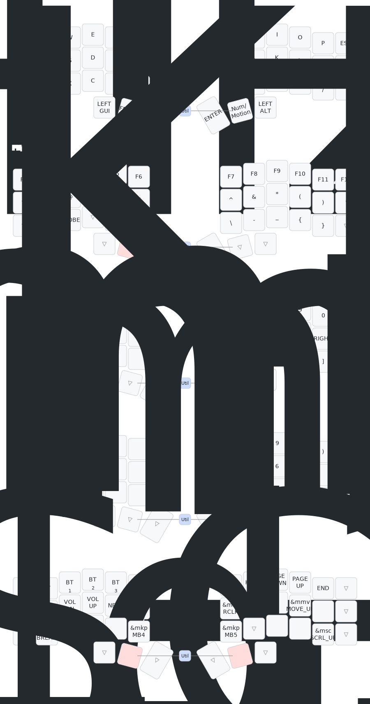

# crkbd

This is the firmware repository for my Corne 6×3+2 split keyboard, built with a [Typeractive](https://www.typeractive.xyz/) kit.

The keyboard features:
- A **nice!nano v2** microcontroller on each half
- A **nice!view** screen on each half
- A custom keymap powered by **ZMK Firmware**

---

## 🔧 Documentation

- 🛠️ [Typeractive Corne Build Guide](https://docs.typeractive.xyz/builds/corne)
- 💻 [Typeractive Software Guide](https://docs.typeractive.xyz/software)
- 📚 [ZMK Documentation](https://zmk.dev/docs)

---

## 🎹 Keymap

> Generated with [caksoylar/keymap-drawer](https://github.com/caksoylar/keymap-drawer)

---

## 🙏 Acknowledgements

- [nickcoutsos/keymap-editor](https://nickcoutsos.github.io/keymap-editor) – for creating layouts
- [caksoylar/keymap-drawer](https://github.com/caksoylar/keymap-drawer) – for drawing SVG diagrams from ZMK keymaps
